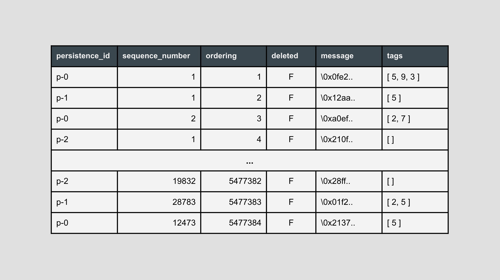
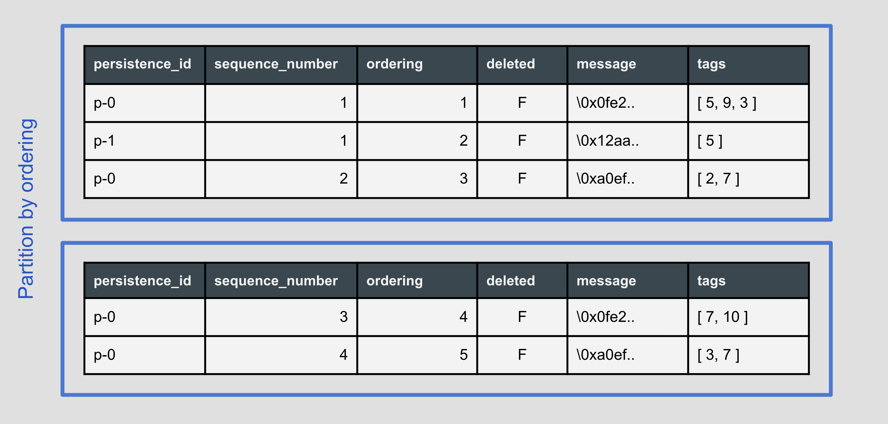

# Key features
{: .no_toc }

## Table of contents
{: .no_toc .text-delta }

1. TOC
{:toc}

## Support for partitioned tables
When you have big volumes of data and they keep growing, appending events to the journal becomes more expensive - indexes are growing together with tables.

Postgres allows you to split your data between smaller tables (logical partitions) and attach new partitions on demand. Partitioning also applies to indexes, so instead of a one huge B-Tree you can have a number of capped tables with smaller indexes.

Currently, plugin supports two variants of the journal table schema:

### Flat journal
A single table, similar to what the JDBC plugin provides. All events are appended to the table. Schema can be found [here]({{ site.repo }}/core/src/test/resources/schema/postgres/plain-schema.sql).

This is the default schema.

### Journal with nested partitions
A journal partitioned by persistenceId and sequenceNumber - this version allows you to shard your events by the persistenceId. Additionally, each of the shards is split by sequenceNumber range to cap the indexes.
You can find the schema [here]({{ repo.url }}/core/src/test/resources/schema/postgres/partitioned-schema.sql).

This variant is aimed for services that have a finite and/or small number of unique persistence aggregates, but each of them has a big journal.

#### Detaching unused partitions

One of the advantages for this variant is that you can detach, dump and remove unused partition (for example - when snapshot has been created) and release the memory (each partition has its own index) and disk space.

The process is simple and can be automated using [this script]({{ site.repo }}/scripts/partitioned/archivisation/).
It's also frictionless - once you detach and remove the unused partition you do not have to reindex the table (which often acquires a lock on the table).

#### Partition pruning

Another plus point is the ability to perform [partition pruning](https://www.postgresql.org/docs/11/ddl-partitioning.html#DDL-PARTITION-PRUNING).
This means that query planner will examine the definition of each partition and prove that the partition need not be scanned because it could not contain any rows meeting the query's `WHERE` clause. When the planner can prove this, it excludes (prunes) the partition from the query plan.

## BRIN index on the ordering column
This plugin has been re-designed in terms of handling very large journals.
The original plugin (akka-persistence-jdbc) uses B-Tree indexes on three columns: `ordering`, `persistence_id` and `sequence_number`. They are great in terms of the query performance and guarding column(s) data uniqueness, but they require relatively a lot of memory.

Wherever it makes sense, we decided to use more lightweight [BRIN indexes](https://www.postgresql.org/docs/11/brin-intro.html).

## Tags as an array of int
Akka-persistence-jdbc stores all tags in a single column as String separated by an arbitrary separator (by default it’s a comma character).

This solution is quite portable, but not perfect. Queries rely on the `LIKE ‘%tag_name%`’ condition and some additional work needs to be done in order to filter out tags that don't fully match the input `tag_name` (imagine a case when you have the following tags: _healthy_, _unhealthy_ and _neutral_ and want to find all events tagged with _healthy_. The query will return events tagged with both, _healthy_ and _unhealthy_ tags).

Postgres allows columns of a table to be defined as variable-length arrays. 
By mapping event tag names into unique numeric identifiers we could leverage intarray extension, which in some circumstances can improve query performance and reduce query costs up to 10x.

## Minor PostgreSQL optimizations
Beside the aforementioned major changes we did some minor optimizations, like changing the column ordering for [more efficient space utilization](https://www.2ndquadrant.com/en/blog/on-rocks-and-sand/).
